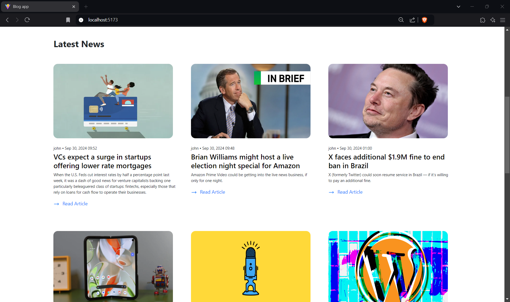
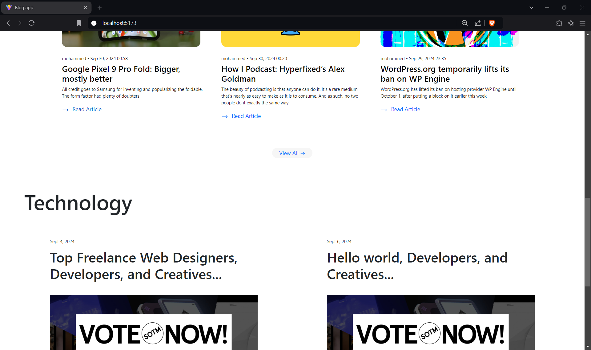
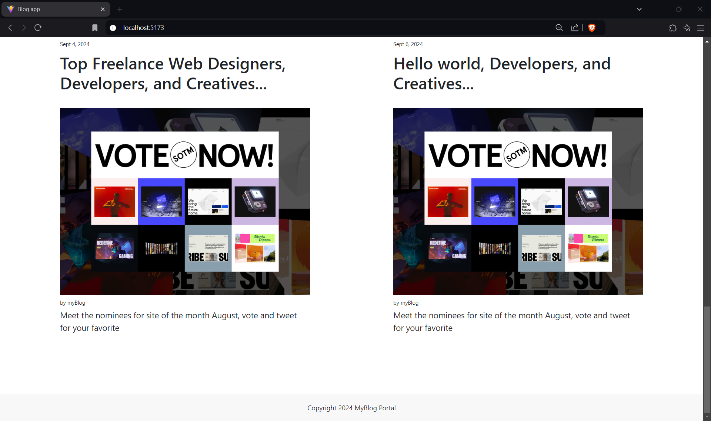
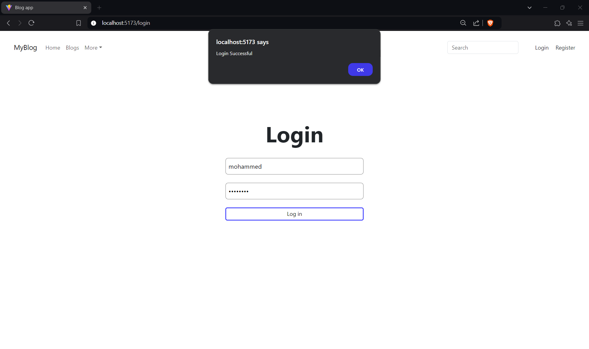
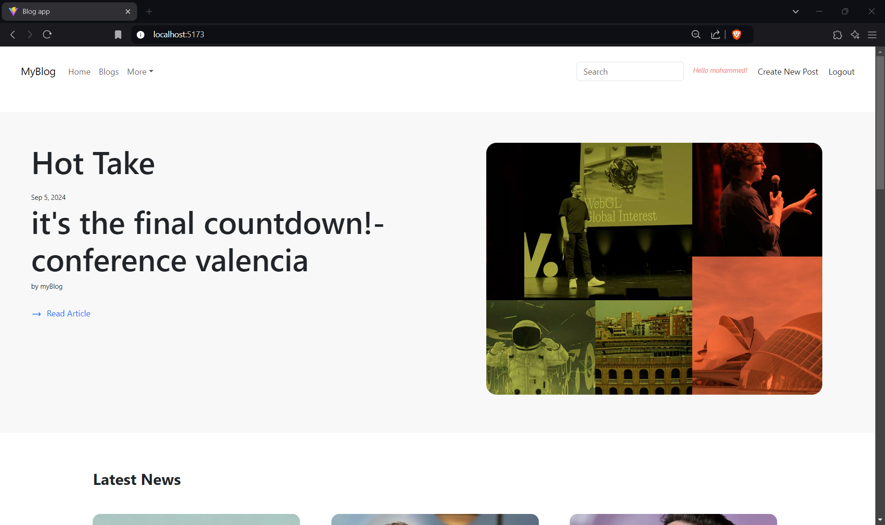
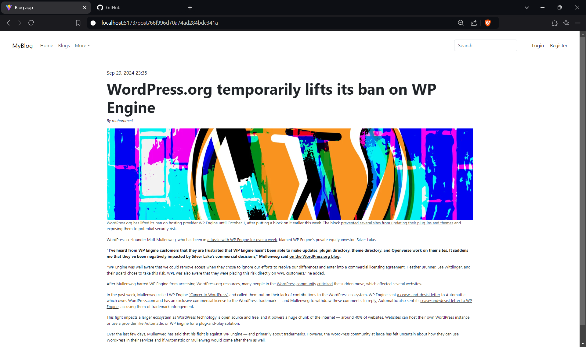
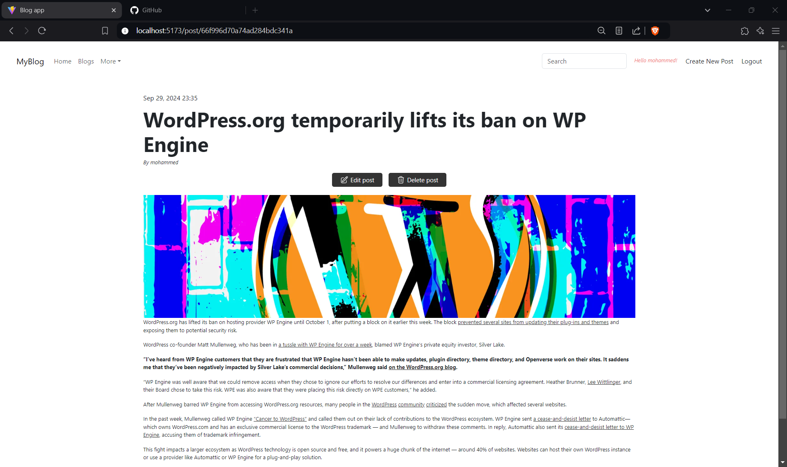
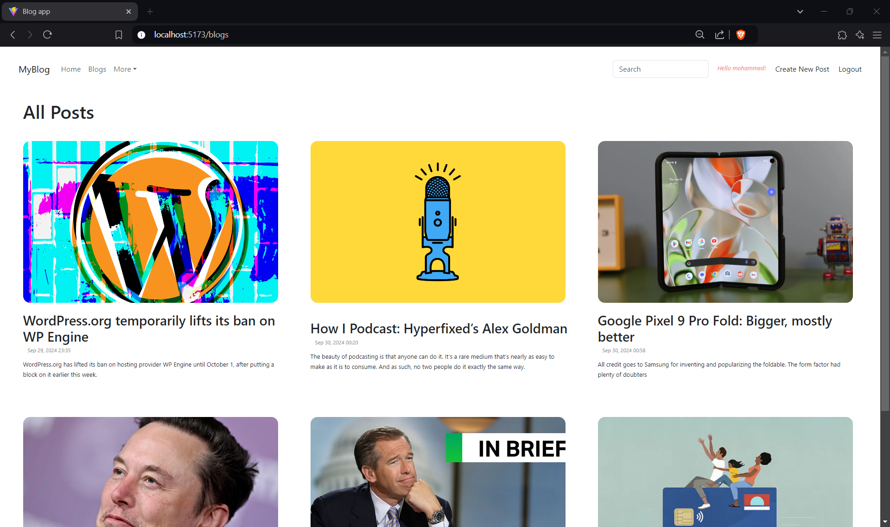

<h1>Blog</h1>

A Blog application built with authentication and authorization mechanisms allowing users to login and create blogs.

<h1>Tools Used</h1>
<ul>
  <li>ViteJs</li>
  <li>React Quil</li>
  <li>NodeJs</li>
  <li>ExpressJs</li>
  <li>MongoDB</li>
  <li>Multer</li>
  <li>React Routing</li>
  <li>User Context</li>
  <li>Axios</li>
  <li>JWT Web Token</li>
  <li>Bcrypt Hashing</li>
  <li>Bootstrap</li>
</ul>

<h1>Screenshots</h1>
<h3>Homepage</h3>

 
<h3>Login Page</h3>
 

 

 
<h3>Blog Page</h3>
 

 
<h3>All Blog</h3>
 

